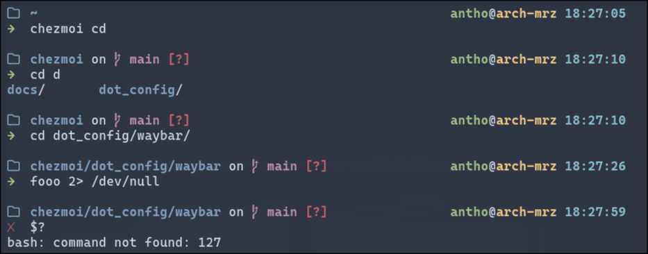

# dotfiles

This repository contains my personal dotfiles, managed with [`chezmoi`](https://www.chezmoi.io/).  
The base configuration is inspired by [Omarchy](https://github.com/basecamp/omarchy) (an opinionated Arch + Hyprland setup, inspired by DHH and Omarchy)
## Table of Contents

1. [Bash](#bash)
   1. [Screenshot](#screenshot)
2. [Wayland environment](#wayland-environment)
3. [Setup](#setup)
   1. [Dotfiles manager](#dotfiles-manager)
   2. [Installation](#installation)

---

## Bash

```sh
$ sudo pacman -S bash
```

### Screenshot



---

## Wayland environment

This setup includes configuration for:

- `waybar` (status bar)
- `hyprland` (Wayland compositor)
- `wofi` (launcher)
- `mako` (notification daemon)
- many more
All config files follow the XDG layout and are managed via chezmoi. Example:

```
dot_config/hypr/hyprland.conf
```

---

## Setup

### Dotfiles manager

Install `chezmoi` to manage and apply the configuration:

```sh
$ sudo pacman -S chezmoi
```

### Installation

To install my setup on a new machine:

```sh
$ chezmoi init https://github.com/antbou/dotfiles.git
$ chezmoi apply
```

This will deploy all configurations into your home directory. You may be prompted to provide your name, email, or system type to personalize some templates (if defined).

---

## Working with chezmoi

- Edit files safely:

```sh
$ chezmoi edit ~/.bashrc
$ chezmoi edit ~/.config/waybar/style.css
```

- Add modified files back to the source state:

```sh
$ chezmoi add ~/.bashrc
```

- Preview changes:

```sh
$ chezmoi diff
```

- Apply updates:

```sh
$ chezmoi apply
```

